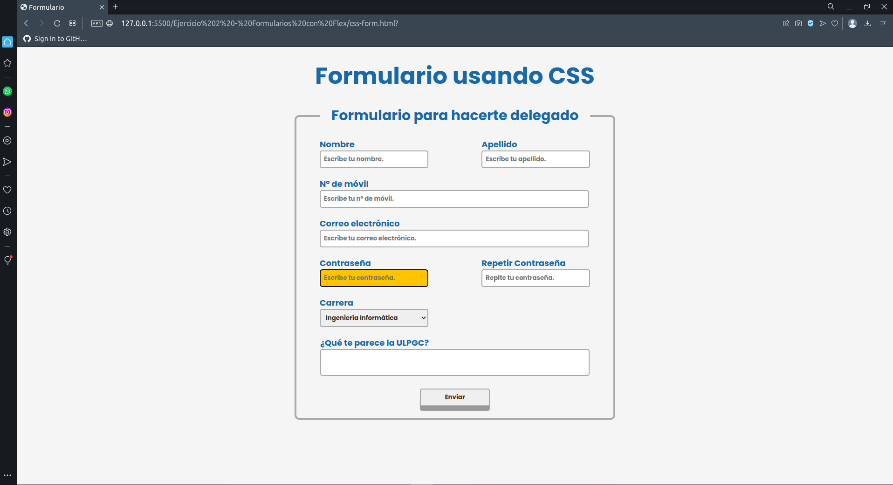

# frontend-start-pack

Este repositorio esta pensado para realizar diferentes ejercicios de HTML y CSS con los que aprenderás lo básico para empezar a desarrollar frontend.

## Primer ejecicio: Carta en HTML

El objetivo de este ejercicio es conocer los principales elementos contenedores y semánticos de HTML. Consistirá en replicar la carta que se muestra a continuación haciendo uso del esqueleto proporcionado en el fichero "PrimerEjercicio.html" y las etiquetas de HTML que consideres oportuna.


Para ayudarte a que la carta se vea como en el ejemplo te hemos añadido un estilo por defecto al esqueleto del ejercicio, puedes consultar este estilo dentro de la carpeta styles del repositorio.

Recuerda que puedes buscar las etiquetas y su uso [aquí](https://developer.mozilla.org/en-US/docs/Web/HTML/Element) y puedes validar la semántica y estructura de tu codigo [aquí](https://validator.w3.org/)

## Segundo Ejercicio : Formulario de la delegación

En este ejercicio realizaremos un pequeño formulario con HTML y CSS, usando como mínimo Flex (aunque si te animas, puedes usar flex y grid).

Tiene que quedar lo más parecido posible a la siguiente imagen:



Para empezar, te dejo la fuente y los colores en el fichero **./styles/SegundoEjercicio.css**, a las variables se accede haciendo uso de:

```apache
.bg{
    background-color: var(--white);
}
```

La idea es crear un formulario con los inputs correctos, y hacer uso de las distintas clases y pseudoclases para conseguir que:

* Al hacer pasar el ratón por encima de TODOS los inputs, el componente se oscurezca (color --gray).
* Al hacer hover cambie el color de la letra del placeholder.
* Al presionar un input de texto o textarea el fondo sea --yellow y la letra sea --black.
* Al clicar el botón la sombra inferior se hará más pequeña, simulando que se ha presionado (para dar feedback

¡Si necesitas cualquier tipo de ayuda , avísanos!


## Tercer Ejercicio : Clone Instagram Responsive

En este ejercicio realizaremos una pequeña copia de la interfaz de la aplicación de instagram con el objetivo de hacer un uso más profundo de los elementos más comunes de HTML y las propiedades de CSS que se suelen aplicar en la mayoría de proyectos reales. El esqueleto para el ejercicio se proporciona en el archivo "TercerEjercicio.html" , el archivo de estilo lo deberas crear dentro de la carpeta styles e importarlo en el archivo de HTML, las fotos las encontrarás dentro de la carpeta assets y los iconos dentro de la carpeta icons que se encuentra en assets.


### Resultado Ordenador


### Resultado Móvil

### Algunos de los aspectos importantes de este ejercicio seran:

- Asegurar que la página responde correctamente cuando la pantalla tiene tamaño movil
- Usar correctamente las etiquetas de HTML
- Evitar el uso de posiciones absolutas y relativas usando CSS
- Hacer uso del menor número posible de media queries
- Debes crear e importar en tu HTML los estilos que creas necesarios
